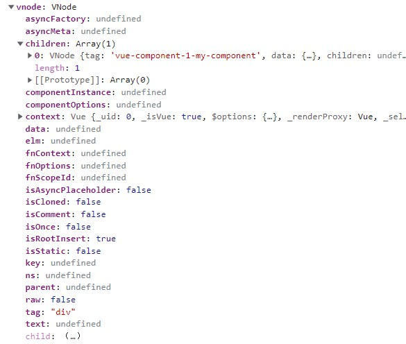

上一篇我们大致介绍了组件的创建及注册过程，还看了`createElement()`方法的过程。本篇我们来看一下`vm._update`方法的首次过程。

示例代码和上一篇一样：

```js
Vue.component('my-component', {
  template: `
    <span>{{text}}</span>
  `,
  data() {
    return {
      text: '我是子组件'
    }
  }
})
new Vue({
  el: '#app',
  template: `
    <div>
      <my-component></my-component>
    </div>
  `
})
```

`_update`方法会在实例的创建及更新时调用：

```js
let updateComponent = () => {
    vm._update(vm._render(), hydrating)
}
```

`_render`方法会执行组件模板生成的渲染函数，生成组件的`VNode`，之前已经介绍过，不再赘述，直接大致看一下本示例生成的`VNode`：



`_update`方法之前的文章里已经介绍过了，所以这里就不再细说，第一次渲染，没有旧的`VNode`，所以会进入下图所示的分支：


`__patch__`方法是`web`环境下特有的：

```js
Vue.prototype.__patch__ = inBrowser ? patch : noop
```

```js
import * as nodeOps from '../../web/runtime/node-ops'
import { createPatchFunction } from '../../../core/vdom/patch'
import baseModules from '../../../core/vdom/modules/index'
import platformModules from '../../web/runtime/modules/index'

// 指令模块应在应用所有内置模块后最后应用。
const modules = platformModules.concat(baseModules)

export const patch = createPatchFunction({ nodeOps, modules })
```

