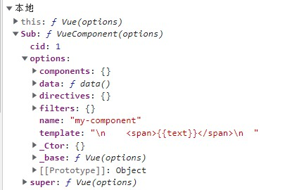
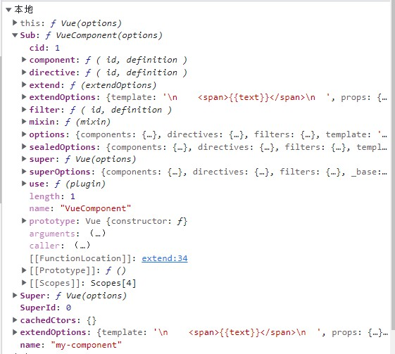
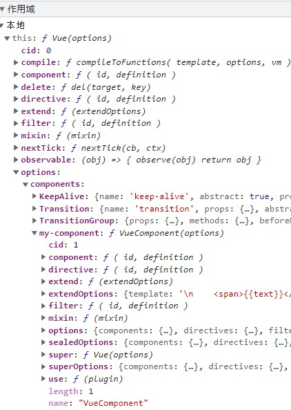
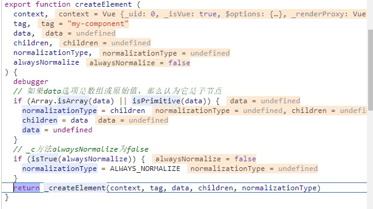
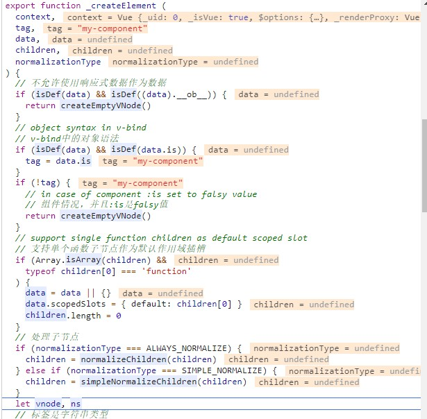
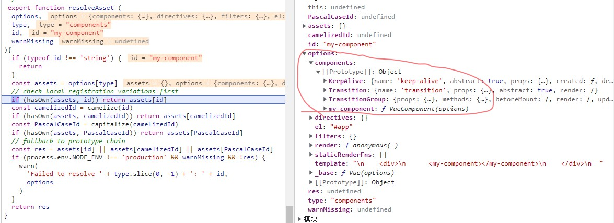
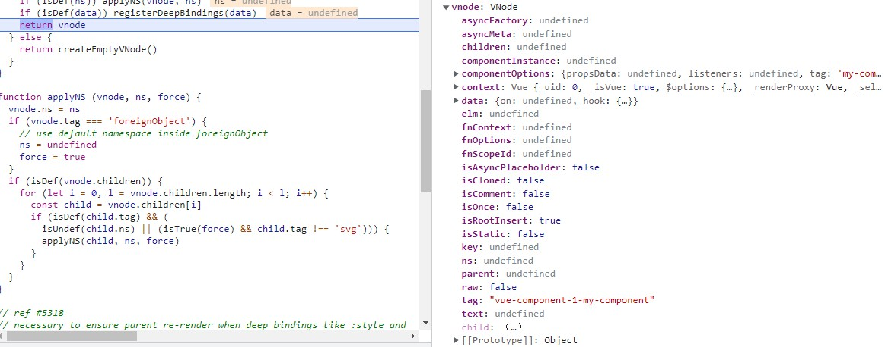

[TOC]

以下面这个十分简单的示例：

```js
Vue.component('my-component', {
  template: `
    <span>{{text}}</span>
  `,
  data() {
    return {
      text: '我是子组件'
    }
  }
})
new Vue({
  el: '#app',
  template: `
    <div>
      <my-component></my-component>
    </div>
  `
})
```

我们来看一下组件是如何渲染出来的。

# extend方法详解

首先来看`Vue.component`方法，这个方法用来注册或获取全局组件，它的定义如下：

```js
const ASSET_TYPES = [
  'component',
  'directive',
  'filter'
]
ASSET_TYPES.forEach(type => {
    Vue[type] = function (
    id,
     definition
    ) {
        // 只传了一个参数代表是获取组件
        if (!definition) {
            return this.options[type + 's'][id]
        } else {
            // 定义组件
            if (type === 'component' && isPlainObject(definition)) {
                // 组件名称
                definition.name = definition.name || id
                definition = this.options._base.extend(definition)
            }
            // ...
            this.options[type + 's'][id] = definition
            return definition
        }
    }
})
```

`_base`其实就是`Vue`构造函数，所以当我们调用`component`方法，其实执行的是`Vue.extend`方法，这个方法`Vue`也暴露出来了，官方的描述是使用基础`Vue`构造器，创建一个`子类`：

```js
Vue.extend = function (extendOptions) {
    extendOptions = extendOptions || {}
    const Super = this
    const SuperId = Super.cid
    // 检测是否存在缓存
    const cachedCtors = extendOptions._Ctor || (extendOptions._Ctor = {})
    if (cachedCtors[SuperId]) {
        return cachedCtors[SuperId]
    }
    // 组件名称
    const name = extendOptions.name || Super.options.name
    // ...
}
```

每个实例构造器，包括`Vue`，都有一个唯一的`cid`，用来支持缓存。

```js
// ...
// 定义一个子类构造函数
const Sub = function VueComponent (options) {
    // 构造函数简洁的优势，不用向传统那样调用父类的构造函数super.call(this)
    this._init(options)
}
// 关联原型链
Sub.prototype = Object.create(Super.prototype)
Sub.prototype.constructor = Sub
Sub.cid = cid++
// 合并参数，将我们传入的组件选项保存为默认选项
Sub.options = mergeOptions(
    Super.options,
    extendOptions
)
Sub['super'] = Super
// ...
```

接下来定义了一个子类的构造函数，因为`Vue`的构造函数里就调用了一个方法，所以这里就没有`call`父类的构造器。

根据前面的文章我们可以知道`Vue`的`options`选项就`components`、`directives`、`filters`及`_base`几个属性，这里会把我们传入的扩展选项和这个合并后作为子类构造器的默认选项：



```js
// ...
if (Sub.options.props) {
    initProps(Sub)
}
if (Sub.options.computed) {
    initComputed(Sub)
}
// ...
```

接下来对于存在`props`和`computed`两个属性时做了一点初始化处理，可以看看具体都做了什么：

```js
function initProps (Comp) {
  const props = Comp.options.props
  for (const key in props) {
    proxy(Comp.prototype, `_props`, key)
  }
}
```

`proxy`方法之前已经介绍过，这里就是把`this._props`上的属性代理到`Comp.prototype`对象上，比如我们创建了一个这个子类构造函数的实例，存在一个属性`type`，然后当我们访问`this.type`时，实际访问的是`Sub.prototype.type`，最终指向的实际是`this._props.type`，代理到原型对象上的好处是只要代理一次，不用每次实例时都做一遍这个操作。

```js
function initComputed (Comp) {
  const computed = Comp.options.computed
  for (const key in computed) {
    defineComputed(Comp.prototype, key, computed[key])
  }
}
```

计算属性和普通属性差不多，只不过调用的是`defineComputed`方法，这个方法之前我们跳过了，因为涉及到计算属性缓存的内容，所以这里我们也跳过，后面再说，反正这里和`proxy`差不多，也是将计算属性代理到原型对象上。

继续`extend`函数：

```js
// ...
Sub.extend = Super.extend
Sub.mixin = Super.mixin
Sub.use = Super.use
// ...
```

将父类的静态方法添加到子类上。

```js
// ...
ASSET_TYPES.forEach(function (type) {
    Sub[type] = Super[type]
})
// ...
```

添加`component`、`directive`、`filter`三个静态方法。

```js
// ...
if (name) {
    Sub.options.components[name] = Sub
}
// ...
```

允许递归查找自己。

```js
// ...
Sub.superOptions = Super.options
Sub.extendOptions = extendOptions
Sub.sealedOptions = extend({}, Sub.options)
// ...
```

保存对一些选项的引用。

```js
// ...
cachedCtors[SuperId] = Sub
return Sub
```

最后通过父类的`id`来进行一个缓存。

可以看到`extend`函数主要就是创建了一个子类，对于我们开头的示例来说，父类是`Vue`构造器，如果我们创建了一个子类`MyComponent`，也可以通过`MyComponent.extend()`再创建一个子类，那么这个子类的父类当然就是`MyComponent`了。

最后我们创建出来的子类如下：



回到开头我们执行的`Vue.component`方法，这个方法执行后的结果就是在`Vue.options.components`对象上添加了`my-component`的构造器。




# 组件对应的VNode

虽然我们不深入看编译过程，但我们可以看一下我们开头示例的模板产出的渲染函数的内容是怎样的：

```
with(this){return _c('div',[_c('my-component')],1)}
```

`_c`就是`createElement`方法的简写：


接下来我们来看看这个`createElement`方法。

## createElement方法详解

```js
export function createElement (
  context,
  tag,
  data,
  children,
  normalizationType,
  alwaysNormalize
) {
  // 如果data选项是数组或原始值，那么认为它是子节点
  if (Array.isArray(data) || isPrimitive(data)) {
    normalizationType = children
    children = data
    data = undefined
  }
  // _c方法alwaysNormalize为false
  if (isTrue(alwaysNormalize)) {
    normalizationType = ALWAYS_NORMALIZE
  }
  return _createElement(context, tag, data, children, normalizationType)
}
```

这个方法其实就是`_createElement`方法的一个包装函数，处理了一下`data`为数组和原始值的情况，接下来看`_createElement`方法：

```js
export function _createElement (
 context,
 tag,
 data,
 children,
 normalizationType
) {
    // data不允许使用响应式数据
    if (isDef(data) && isDef((data).__ob__)) {
        return createEmptyVNode()
    }
    // 存在:is，那么标签为该指令的值
    if (isDef(data) && isDef(data.is)) {
        tag = data.is
    }
    // 标签不存在，可能是:is的值为falsy的情况
    if (!tag) {
        return createEmptyVNode()
    }
    // 支持单个函数子节点作为默认的作用域插槽
    if (Array.isArray(children) &&
        typeof children[0] === 'function'
       ) {
        data = data || {}
        data.scopedSlots = { default: children[0] }
        children.length = 0
    }
    // 规范化处理子节点
    if (normalizationType === ALWAYS_NORMALIZE) {
        children = normalizeChildren(children)
    } else if (normalizationType === SIMPLE_NORMALIZE) {
        children = simpleNormalizeChildren(children)
    }
    // ...
}
```

先是对一些情况做了判断和相应的处理。

```js
// ...
let vnode, ns
// 标签是字符串类型
if (typeof tag === 'string') {
    let Ctor
    ns = (context.$vnode && context.$vnode.ns) || config.getTagNamespace(tag)
    // 判断是否是保留标签
    if (config.isReservedTag(tag)) {
        vnode = new VNode(
            config.parsePlatformTagName(tag), data, children,
            undefined, undefined, context
        )
    } else if ((!data || !data.pre) && isDef(Ctor = resolveAsset(context.$options, 'components', tag))) {// 是注册的组件
        vnode = createComponent(Ctor, data, context, children, tag)
    } else {
        // 未知或未列出的命名空间元素，在运行时检查，因为当其父项规范化子项时，可能会为其分配命名空间
        vnode = new VNode(
            tag, data, children,
            undefined, undefined, context
        )
    }
} else {
    // 直接是组件选项或构造器
    vnode = createComponent(tag, data, context, children)
}
// ...
```

紧接着根据标签名的类型来判断是普通元素还是组件。

```js
// ...
if (Array.isArray(vnode)) {
    return vnode
} else if (isDef(vnode)) {
    if (isDef(ns)) applyNS(vnode, ns)
    if (isDef(data)) registerDeepBindings(data)
    return vnode
} else {
    return createEmptyVNode()
}
```

最后根据`vnode`的类型来返回不同的虚拟节点数据。

中间的一些细节我们并没有看，因为没有遇到具体的情况也看不明白，所以接下来我们以前面的模板渲染函数为例来看看具体过程，忘了没关系，就是这样的：

```js
with(this){return _c('div',[_c('my-component')],1)}
```

## 创建组件虚拟节点

`_c('my-component')`，即`createElement(vm, 'my-component', undefined, undefined, undefined, false)`，`vm`即我们通过`new Vue`创建的实例，



上面两个条件分支都不会进入，直接到`_createElement`函数。



因为`data`和`children`都不存在，所以也会一路跳过来到了下面：


`config`对象里的方法都是平台相关的，`web`和`weex`环境下是不一样的，我们看`web`平台下的`getTagNamespace`方法：

```js
export function getTagNamespace (tag) {
  if (isSVG(tag)) {
    return 'svg'
  }
  // 对MathML的基本支持，注意，它不支持其他MathML元素作为组件根的节点
  if (tag === 'math') {
    return 'math'
  }
}

// 在下面列表中则返回true
export const isSVG = makeMap(
  'svg,animate,circle,clippath,cursor,defs,desc,ellipse,filter,font-face,' +
  'foreignObject,g,glyph,image,line,marker,mask,missing-glyph,path,pattern,' +
  'polygon,polyline,rect,switch,symbol,text,textpath,tspan,use,view',
  true
)
```

`my-component`是我们自定义的组件，并不存在命名空间，继续往下：


接下来判断是否是内置标签，看看`isReservedTag`方法：

```js
export const isReservedTag = (tag) => {
  return isHTMLTag(tag) || isSVG(tag)
}

export const isHTMLTag = makeMap(
  'html,body,base,head,link,meta,style,title,' +
  'address,article,aside,footer,header,h1,h2,h3,h4,h5,h6,hgroup,nav,section,' +
  'div,dd,dl,dt,figcaption,figure,picture,hr,img,li,main,ol,p,pre,ul,' +
  'a,b,abbr,bdi,bdo,br,cite,code,data,dfn,em,i,kbd,mark,q,rp,rt,rtc,ruby,' +
  's,samp,small,span,strong,sub,sup,time,u,var,wbr,area,audio,map,track,video,' +
  'embed,object,param,source,canvas,script,noscript,del,ins,' +
  'caption,col,colgroup,table,thead,tbody,td,th,tr,' +
  'button,datalist,fieldset,form,input,label,legend,meter,optgroup,option,' +
  'output,progress,select,textarea,' +
  'details,dialog,menu,menuitem,summary,' +
  'content,element,shadow,template,blockquote,iframe,tfoot'
)
```

列出了`html`的所有标签名。这里显然也不是，继续往下：


`data`不存在，所以会执行`resolveAsset`方法：



这个实例本身的`options.components`对象是空的，但是在第二篇【new Vue时做了什么】中我们介绍了实例化时选项合并的过程，对于`components`选项来说，会把构造函数的该选项以原型的方式挂载到实例的该选项上，可以看到图上的右边是存在我们注册的全局组件`my-component`的，所以最后会在原型链上找到我们组件的构造函数。继续往下：


接下来会执行`createComponent`方法，顾名思义，创建组件，这个方法也很长，但是对于我们这里的情况来说大部分逻辑都不会进入，精简后代码如下：

```js
export function createComponent (
 Ctor,
 data,
 context,
 children,
 tag
) {
    const name = Ctor.options.name || tag
    const vnode = new VNode(
        `vue-component-${Ctor.cid}${name ? `-${name}` : ''}`,
        data, undefined, undefined, undefined, context,
        { Ctor, propsData, listeners, tag, children },
        asyncFactory
    )
    return vnode
}
```

可以看到也是创建了一个`VNode`实例，标签名是根据组件的`cid`和`name`拼接成的，其实就是创建了一个组件的占位节点。

回到`_createElement`方法，最后对于`my-component`组件来说，创建的`VNode`如下：



## 创建html虚拟节点

接下来看`_c('div',[_c('my-component')],1)`的过程，和`my-component`差不多，但是可以看到第三个参数传的是`1`，也就是`normalizationType`的值为`1`，所以会进入`simpleNormalizeChildren`分支：


```js
export function simpleNormalizeChildren (children) {
  for (let i = 0; i < children.length; i++) {
    if (Array.isArray(children[i])) {
      return Array.prototype.concat.apply([], children)
    }
  }
  return children
}
```

这个函数也很简单，就是判断子节点中是否存在数组，是的话就把整个数组拍平。继续：


`div`显然是保留标签，所以直接创建一个对应的`vnode`。

所以最终上面的渲染函数的产出就是一个虚拟`DOM`树，根节点是`div`，子节点是`my-component`：


根据上一篇文章的介绍，执行渲染函数是通过`vm._render()`方法，产出的虚拟`DOM`树会传递给`vm._update()`方法来生成实际的`DOM`节点。这部分的内容我们后面有机会再探讨。

